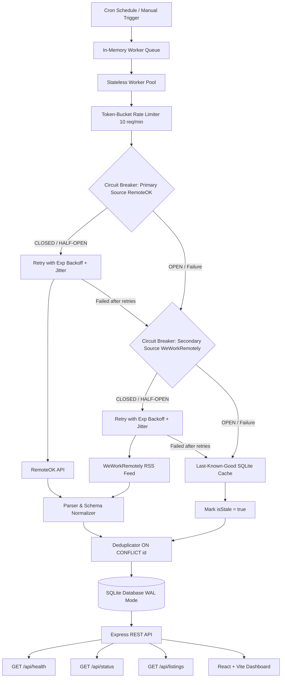

# Resilient Job Listing Ingestion Pipeline

A fault-tolerant job listing ingestion pipeline and monitoring dashboard built for the **ACDYON Technologies Engineering Challenge — Part 1: "Getting Data Out of a Platform That Doesn't Want You To"**.

Demonstrates resilient ingestion architecture using production-oriented reliability patterns on low-risk public structured feeds (RemoteOK API & WeWorkRemotely RSS). **Does NOT scrape live LinkedIn accounts or attempt anti-bot/CAPTCHA bypass.**

---

## 🔗 Live Demo & Submission Links

- 🖥️ **Live Deployed App & Dashboard**: [https://job-listing-ingestion-pipeline.onrender.com](https://job-listing-ingestion-pipeline.onrender.com)
- 📡 **Health Check Endpoint**: [https://job-listing-ingestion-pipeline.onrender.com/api/health](https://job-listing-ingestion-pipeline.onrender.com/api/health)
- 📊 **Pipeline Status & Metrics API**: [https://job-listing-ingestion-pipeline.onrender.com/api/status](https://job-listing-ingestion-pipeline.onrender.com/api/status)
- 💼 **Job Listings API**: [https://job-listing-ingestion-pipeline.onrender.com/api/listings](https://job-listing-ingestion-pipeline.onrender.com/api/listings)
- 📄 **1-Page Decisions Document**: [`DECISIONS.md`](file:///Users/shauryaverma/Desktop/ACDYON%20TECHNOLOGIES%20Assignment/DECISIONS.md) ([GitHub View](https://github.com/shauryaverma03/Job-Listing-Ingestion-Pipeline/blob/main/DECISIONS.md))
- 🐙 **GitHub Repository**: [https://github.com/shauryaverma03/Job-Listing-Ingestion-Pipeline](https://github.com/shauryaverma03/Job-Listing-Ingestion-Pipeline)

---

## 🏗️ Architecture Diagram



---

## ⚡ Core Features

- **Public Feed Ingestion**: Ingests structured job postings from RemoteOK JSON API and WeWorkRemotely RSS.
- **Token-Bucket Rate Limiter**: Caps requests per source per minute (`RATE_LIMIT_PER_MIN=10`) with continuous token refills.
- **Retry + Exponential Backoff + Jitter**: Automatically retries 5xx server errors, 429 rate limits, and network timeouts up to 3 times while skipping non-retryable 4xx errors.
- **3-State Circuit Breaker**: State machine (`CLOSED` ➔ `OPEN` ➔ `HALF_OPEN` ➔ `CLOSED`) that trips after 5 consecutive failures with a 30-second cooldown period.
- **Multi-Tier Fallback Strategy**: Primary Source (`RemoteOK`) ➔ Secondary Source (`WeWorkRemotely RSS`) ➔ Last-Known-Good SQLite Cache (`isStale: true`).
- **Deterministic Deduplication**: Prevents duplicate insertions across runs using stable source IDs and deterministic URL/company hashes.
- **System Pipeline Logs**: Native macOS terminal window UI with live log streaming, grep filtering, level badges, and export capabilities.
- **Failure Simulation Engine**: Interactive UI buttons and API endpoints to simulate primary failure and test recovery live.

---

## 🛡️ Detection Surface & ToS Boundary Analysis

### Detection Surface Risk Matrix

| Detection Vector | Risk Severity | Pipeline Mitigation Strategy | Status |
| :--- | :--- | :--- | :--- |
| **Request Frequency & Bursts** | High | Token-bucket rate limiter enforces strict request-per-minute caps per source | **Mitigated** |
| **Request Timing & Patterns** | Medium | Exponential backoff includes random delay jitter (0-400ms) to randomize intervals | **Mitigated** |
| **Browser Fingerprinting** | High | Avoided entirely by using lightweight HTTP client instead of headless browser automation | **Avoided** |
| **CAPTCHA Challenges** | Critical | Not attempted. Pipeline relies on public structured endpoints rather than anti-bot bypass | **Avoided** |
| **IP Rate Limits & Throttling** | High | Respects HTTP 429 responses with exponential backoff & trips circuit breaker when blocked | **Mitigated** |
| **Session Tracking** | Low | Uses stateless public endpoints requiring zero authentication cookies or login tokens | **Avoided** |

### Terms of Service & Legal Boundary Statement
- **Public Low-Risk Sources**: The live demo strictly utilizes public JSON APIs and RSS feeds that permit automated feed consumption.
- **No Access Control Evasion**: The pipeline does **NOT** attempt to bypass login walls, CAPTCHAs, authentication tokens, or anti-bot defenses on platforms like LinkedIn, Indeed, or Naukri.
- **ToS Compliance**: If a platform explicitly prohibits automated access via ToS, the system relies on official partner APIs or public feeds.

---

## 💻 Tech Stack

- **Backend**: Node.js, Express, `better-sqlite3` (SQLite WAL mode), `rss-parser`, `node-cron`
- **Frontend**: React, Vite, Glassmorphism Vanilla CSS, Lucide React Icons
- **Testing**: Node.js native test runner (`node --test`)
- **Dev Tooling**: `concurrently`, `dotenv`

---

## 📡 REST API Endpoints

| Method | Endpoint | Description |
| :--- | :--- | :--- |
| `GET` | `/api/health` | Service health status, uptime seconds, and DB connectivity |
| `GET` | `/api/listings` | Paginated, searchable job listings (`?page=1&limit=12&search=react&source=RemoteOK`) |
| `GET` | `/api/status` | Pipeline metrics: total requests, success rate %, circuit breaker states, rate limit tokens |
| `POST` | `/api/fetch/trigger` | Manually enqueue an immediate ingestion job |
| `POST` | `/api/simulate/failure` | Demo failure simulation (`{ "source": "RemoteOK", "enable": true }`) |
| `POST` | `/api/simulate/reset` | Reset all failure simulations and restore circuit breakers to CLOSED |
| `GET` | `/api/logs` | Real-time structured console logs stream |

---

## 🚀 Running & Deployment

### Local Setup
```bash
npm install
npm run dev
```
- **Dashboard**: `http://localhost:5173`
- **API Server**: `http://localhost:5001/api/health`

### Render Deployment Settings
- **Build Command**: `npm install && npm run build`
- **Start Command**: `npm start`

### 3. Run Automated Tests
```bash
npm test
```

---

## 🧪 Testing Failure Simulation Live

You can test the multi-tier fallback chain live in the dashboard or via API:
1. Click **"Simulate Primary Failure"** in the Circuit Breaker panel. This triggers a controlled primary-source failure.
2. Repeated failures cause the circuit breaker to transition to `OPEN` (after reaching `CB_FAILURE_THRESHOLD=5`), after which the pipeline automatically routes requests to the secondary source (`WeWorkRemotely RSS`).
3. If both sources fail, the system serves last-known-good cached data from SQLite marked with `isStale: true` metadata.
4. Click **"Reset Breakers"** to restore all circuit breakers to `CLOSED` state.

---

## 📋 Assignment Compliance Matrix

| Requirement | Implementation Component | Verified |
| :--- | :--- | :---: |
| **Detection Surface** | Documented analysis in README.md & DECISIONS.md | ✅ |
| **Ingestion Strategy** | `src/fetcher/sources/remoteok.js` & `weworkremotely.js` | ✅ |
| **Rate Limiting** | `src/rateLimiter/tokenBucket.js` (`RATE_LIMIT_PER_MIN=10`) | ✅ |
| **Retry & Backoff** | `src/fetcher/retry.js` (Exponential backoff + jitter) | ✅ |
| **Circuit Breaker** | `src/circuitBreaker/circuitBreaker.js` (3-State Machine) | ✅ |
| **Multi-Tier Fallback** | `src/fetcher/fetcherService.js` (Primary ➔ Secondary ➔ Cache) | ✅ |
| **Deduplication** | `src/storage/db.js` (`INSERT ON CONFLICT(id) DO UPDATE`) | ✅ |
| **Health Endpoint** | `GET /api/health` in `src/api/routes.js` | ✅ |
| **Failure Simulation** | `POST /api/simulate/failure` & UI toggle buttons | ✅ |
| **Automated Tests** | `tests/pipeline.test.js` (`npm test`) | ✅ |
| **1-Page DECISIONS.md** | `DECISIONS.md` in repository root | ✅ |
| **Clean Repo & .gitignore** | Database, `.env`, `node_modules` untracked | ✅ |
