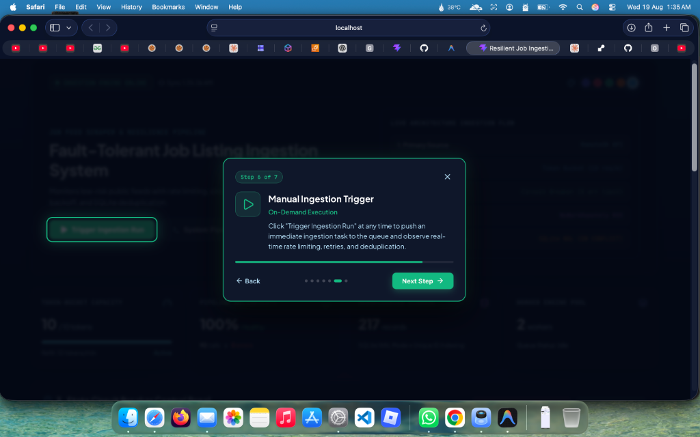
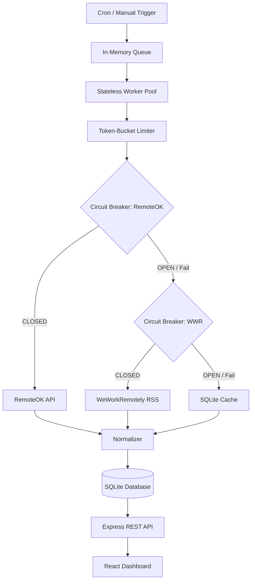
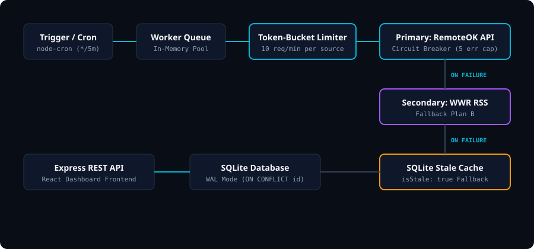

# Job Listing Ingestion Pipeline


> **Live Demo**: [https://job-listing-ingestion-pipeline.onrender.com](https://job-listing-ingestion-pipeline.onrender.com)

Fault-tolerant web crawler and ingestion pipeline built for Part 1 of the **ACDYON Technologies Engineering Challenge**. The system ingests job listings on a schedule from low-risk public structured feeds (RemoteOK API & WeWorkRemotely RSS) using token-bucket rate limiting, 3-state circuit breakers, exponential backoff retries, and deduplicated SQLite storage.



---

## Architecture





---

## Core Features

- **Multi-Tier Fallback Chain**: Primary source (`RemoteOK API`) ➔ Secondary source (`WeWorkRemotely RSS`) ➔ Last-Known-Good SQLite Cache (`isStale: true`).
- **Live Failure Simulation**: Interactive controls and REST API (`POST /api/simulate/failure`) to test circuit breaker failover on-demand.
- **3-State Circuit Breaker**: State machine (`CLOSED` ➔ `OPEN` ➔ `HALF_OPEN`) with a 5-error threshold and 30s cooldown.
- **Token-Bucket Rate Limiter**: Pacing system capping requests per source (10 req/min) with continuous token refills.
- **Exponential Retry Backoff**: Retries transient 429/5xx errors with random jitter while fast-failing non-retryable 4xx errors.
- **Deterministic Deduplication**: Normalizes records into a canonical schema and prevents duplicate entries via SQLite unique constraints.

---

## Quickstart

```bash
npm install && npm run dev
```

- **Dashboard**: `http://localhost:5173`
- **Health Endpoint**: `http://localhost:5001/api/health`
- **Run Tests**: `npm test`

---

## REST API Reference

| Method | Endpoint | Description |
| :--- | :--- | :--- |
| `GET` | `/api/health` | Service health status, uptime, and database connectivity |
| `GET` | `/api/listings` | Paginated, searchable job listings (`?page=1&limit=12&search=react`) |
| `GET` | `/api/status` | Real-time pipeline metrics, circuit breaker states, and token levels |
| `POST` | `/api/fetch/trigger` | Enqueue an immediate ingestion task |
| `POST` | `/api/simulate/failure` | Trigger simulated source failure (`{ "source": "RemoteOK", "enable": true }`) |
| `POST` | `/api/simulate/reset` | Reset failure simulations and restore circuit breakers to CLOSED |
| `GET` | `/api/logs` | Real-time structured console logs stream |

---

## Detection Surface Analysis

| Detection Vector | Pipeline Mitigation Strategy | Status |
| :--- | :--- | :--- |
| **Request Frequency & Bursts** | Token-bucket rate limiter enforces strict request-per-minute caps per source | **Mitigated** |
| **Request Timing & Patterns** | Exponential backoff includes random delay jitter (0-400ms) to randomize intervals | **Mitigated** |
| **Browser Fingerprinting** | Avoided entirely by using lightweight HTTP client instead of headless browser automation | **Avoided** |
| **CAPTCHA Challenges** | Not attempted. Pipeline relies on public structured endpoints rather than anti-bot bypass | **Avoided** |
| **IP Rate Limits & Throttling** | Respects HTTP 429 responses with exponential backoff & trips circuit breaker when blocked | **Mitigated** |
| **Session Tracking** | Uses stateless public endpoints requiring zero authentication cookies or login tokens | **Avoided** |

---

## Tech Stack

`Node.js (Express)`, `React (Vite)`, `SQLite (better-sqlite3)`, `rss-parser`, `node-cron`, `concurrently`.

---

## Technical Decisions & Trade-offs

For detailed technical trade-offs, architecture decisions, and AI tool usage verification, see [`DECISIONS.md`](DECISIONS.md).
